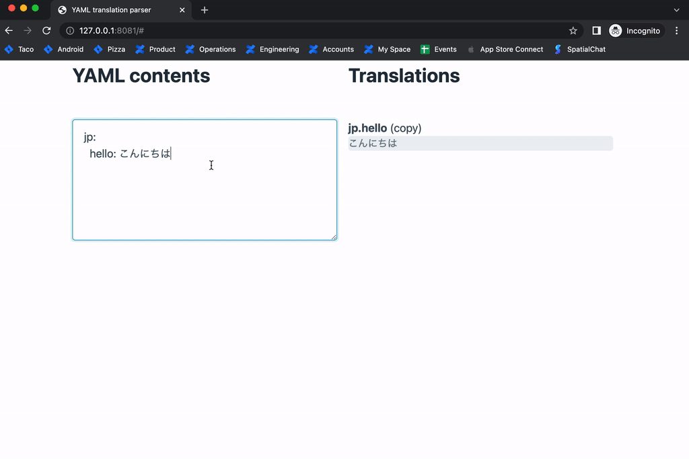

# Yaml Translation Viewer

This is a tiny app to take a Yaml text and generate easily copyable texts which otherwise requires a lot of selecting and de-tabbing to do if manually editing a yaml file.

